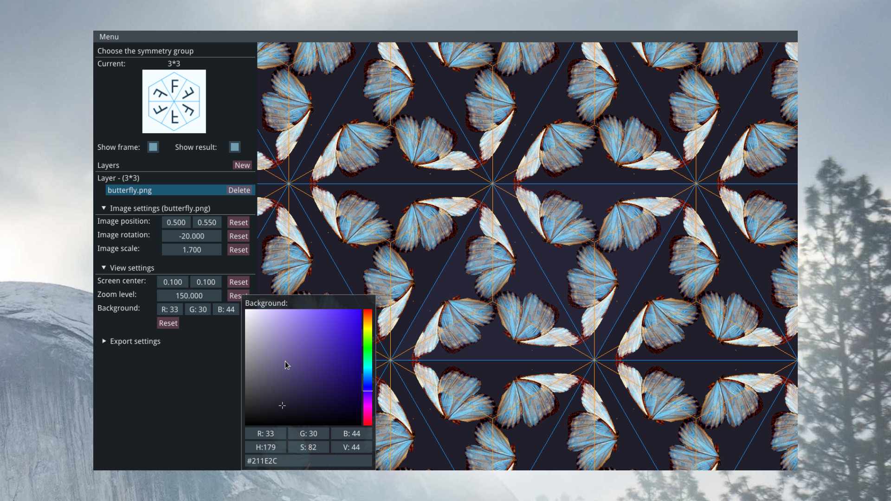

### Dependencies:
- [GLFW](http://www.glfw.org)
- [GLEW](https://github.com/nigels-com/glew)
- [Eigen](http://eigen.tuxfamily.org/index.php?title=Main_Page)
- [Dear ImGui](https://github.com/ocornut/imgui), an older version already included (MIT license)

### Building and running:
```bash
make -j5
./bin/symmetrifier
```
or with CMake:
```bash
mkdir build && cd build
cmake ..
cd ..
./build/symmetrifier
```
Since some shader locations are hardcoded for now, it is necessary to run the application from the repository root.

### Usage preview:

